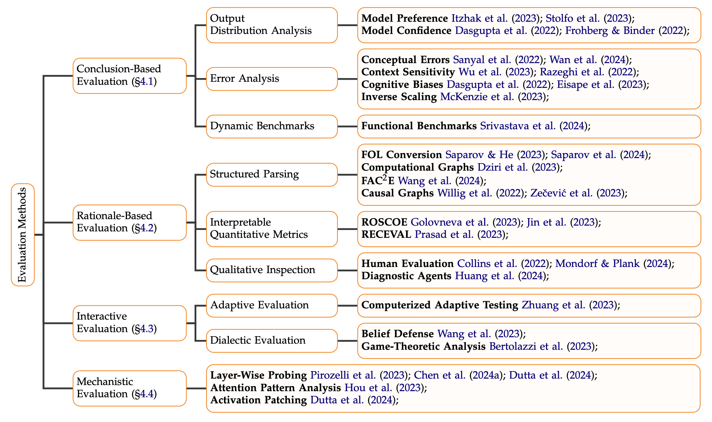

  <!-- Image -->
  

  <!-- Text Info -->
  

    <h3>Beyond Accuracy: Evaluating the Reasoning Behavior of Large Language Models - A Survey</h3>

    
Philipp Mondorf, & Barbara Plank. (2024). <i>Beyond Accuracy: Evaluating the Reasoning Behavior of Large Language Models - A Survey</i>. ArXiv:2404.01869 [cs.CL].
 
    
<a href="https://arxiv.org/abs/2404.01869">Read Paper</a>

  

  <!-- Image -->
  

  <!-- Text Info -->
  

    <h3>Comparing Inferential Strategies of Humans and Large Language Models in Deductive Reasoning</h3>

    
Philipp Mondorf, & Barbara Plank. (2024). <i>Comparing Inferential Strategies of Humans and Large Language Models in Deductive Reasoning</i>. ArXiv:2402.14856 [cs.CL].
 
    
<a href="https://arxiv.org/abs/2402.14856">Read Paper</a>

  

