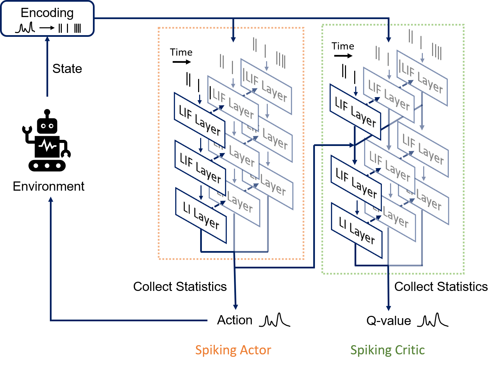
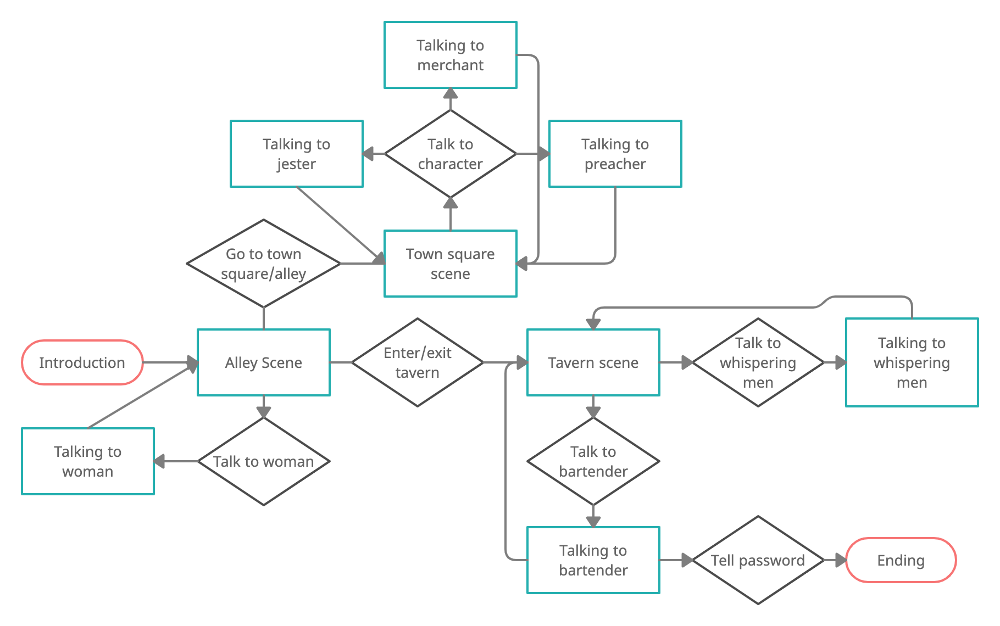
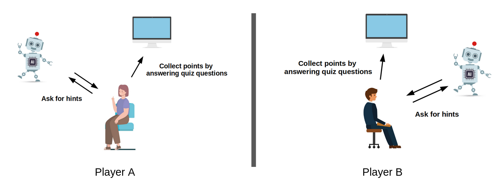
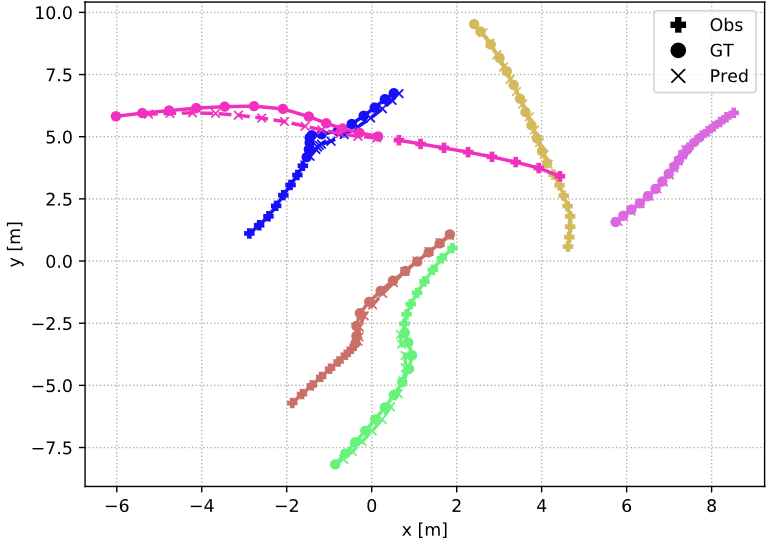

  <!-- Image -->
  

  <!-- Text Info -->
  

<h3>Spiking Reinforcement Learning for Robust Robot Control Under Varying Operating Conditions</h3>

P. Mondorf (2022). <i>Spiking Reinforcement Learning for Robust Robot Control Under Varying Operating Conditions</i>. M.Sc. Thesis, School of Electrical Engineering and Computer Science, KTH Royal Institute of Technology.
 

<a href="https://github.com/PMMon/SpikingRL_RobustControl/blob/main/MSc_Thesis_PhilippMondorf.pdf">Read M.Sc. Thesis</a>

  

  <!-- Image -->
  

  <!-- Text Info -->
  

<h3>The Influence of Emotion Detection on User’s Engagement in an Interactive Storytelling Scenario</h3>

S. Antaris, W. Eriksson and P. Mondorf (2022). <i>The Influence of Emotion Detection on User’s Engagement in an Interactive Storytelling Scenario</i>. Project Report, Division of Speech, Music and Hearing, KTH Royal Institute of Technology.
 

<a href="https://github.com/PMMon/ERStoryteller/blob/main/ProjectReport.pdf">Read Report</a> | <a href="https://github.com/PMMon/ERStoryteller">Code</a>

  

  <!-- Image -->
  

  <!-- Text Info -->
  

<h3>Risks of Conversational Robots as Moral Agents Influencing Humans towards Unethical Behaviours</h3>

J. Almeida, M. Fraile, P. Mondorf and V. Sanchez (2022). <i>Risks of Conversational Robots as Moral Agents Influencing Humans towards Unethical Behaviours</i>. Project Report, Division of Robotics, Perception and Learning, KTH Royal Institute of Technology.
    

<a href="https://github.com/PMMon/PersuasiveFurhat/blob/main/ProjectReport.pdf">Read Report</a> | <a href="https://github.com/PMMon/PersuasiveFurhat">Code</a>
 

  

  <!-- Image -->
  

  <!-- Text Info -->
  

<h3>Pedestrian Tracking in Video Sequences using Particle Filters</h3>

P. Mondorf, T. Labourdette‑Liaresq and D. Singh (2021). <i>Pedestrian Tracking in Video Sequences using Particle Filters</i>. Project Report, Division of Robotics, Perception and Learning, KTH Royal Institute of Technology.

<a href="https://github.com/PMMon/PedestrianTracking_PF/blob/master/EL2320_ProjectReport_PhilippMondorf.pdf">Read Report</a> | <a href="https://github.com/PMMon/PedestrianTracking_PF">Code</a>
 

  

  <!-- Image -->
  

  <!-- Text Info -->
  

<h3>Modeling Social Interactions for Pedestrian Trajectory Prediction on Real and Synthetic Datasets</h3>

P. Mondorf (2020). <i>Modeling Social Interactions for Pedestrian Trajectory Prediction on Real and Synthetic Datasets</i>, B.Sc. Thesis, Department of Informatics, Technical University of Munich.
   

<a href="https://github.com/PMMon/Thesis_Social_Interactions/blob/master/Bachelor_Thesis_Philipp_Mondorf.pdf">Read B.Sc. Thesis</a> | <a href="https://github.com/PMMon/Thesis_Social_Interactions">Code</a>
  

  

